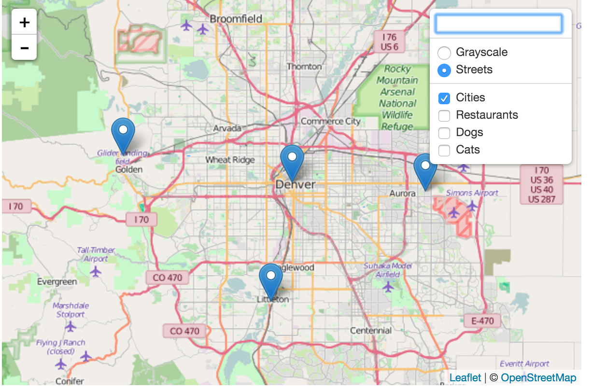
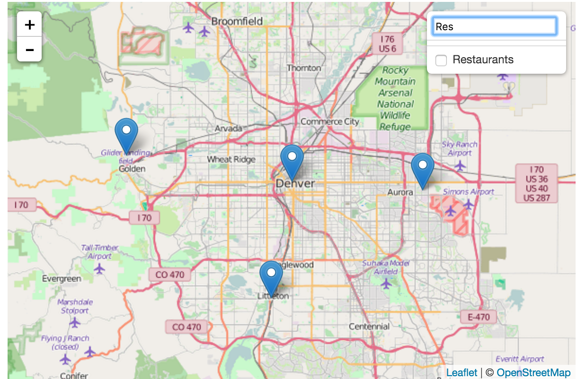

Leaflet.filterablelayercontrol
===========================

Leaflet layer control with filterable layer list. When layers list is really long, this plugin is really helpful to quickly filter them.




## Installation

Include the compressed JavaScript and CSS files located in the `/dist` folder.

This project is also available via bower and jspm:

```
bower install leaflet-filterable-layer-control
```

## Usage

### Initialization

Add groupings to your overlay layers object, and swap out the default layer
control with the new one.

```javascript
var map = L.map('map', {
  center: [39.73, -104.99],
  zoom: 10,
  layers: [ExampleData.Basemaps.Grayscale, ExampleData.LayerGroups.cities]
});

// Overlay layers are grouped
var overlays = {
  "Cities": ExampleData.LayerGroups.cities,
  "Restaurants": ExampleData.LayerGroups.restaurants,
  "Dogs": ExampleData.LayerGroups.dogs,
  "Cats": ExampleData.LayerGroups.cats
};

// Use the custom grouped layer control, not "L.control.layers"
L.control.FilterableLayers(ExampleData.Basemaps, overlays).addTo(map);
```
